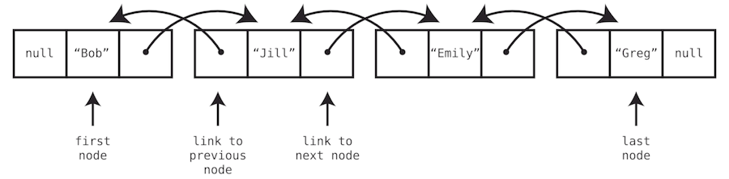

#  Introduction to Doubly Linked Lists

## Introduction

Welcome to our exploration of linked lists! Today, we'll delve into a special variant of linked lists known as the
doubly linked list. This lesson will help you understand the structure of doubly linked lists and how they offer
additional capabilities compared to the classic linked list.

## Learning Objectives

By the end of this lesson, you will be able to:

1. Describe what a doubly linked list is and how it differs from a classic linked list.
2. Explain the elements of each node in a doubly linked list, including the data and two links (next and previous).
3. Demonstrate how to traverse a doubly linked list both forwards and backwards.
4. Discuss the operational advantages of doubly linked lists, such as ease of insertion and deletion at both ends, and
   why these features make doubly linked lists suitable for certain applications.

## Lesson Overview (60 minutes)

1. [Introduction to Linked Lists](#introduction-to-linked-lists)
2. [What is a Doubly Linked List?](#what-is-a-doubly-linked-list)
3. [Key Features](#key-features)
4. [Visual Representation](#visual-representation)
5. [Moving Forward and Backward](#moving-forward-and-backward)
6. [Summary and Key Takeaways](#summary-and-key-takeaways)

## Introduction to Linked Lists

Linked lists are a fundamental data structure in computer science, used to store collections of elements. Traditionally,
linked lists allow sequential access to its elements by moving forward from the first node. However, by enhancing the
basic structure, we can increase the flexibility of linked lists.

## What is a Doubly Linked List?

A doubly linked list is an advanced version of the classic linked list. Each node in a doubly linked list contains:

- **Data**: The value or data stored in the node.
- **Next Link**: A reference to the next node in the list.
- **Previous Link**: A reference to the previous node in the list.

This structure allows each node to connect to both its predecessor and successor in the list, enabling bidirectional
traversal of the list.

## Key Features

- **Bidirectional Traversal**: Unlike classic linked lists, doubly linked lists allow nodes to be traversed in both
  forward and backward directions. This is particularly useful in applications where navigation in either direction is
  frequent.
- **Enhanced Flexibility**: Operations such as insertion and deletion are more efficient at both ends of the list, as
  the list maintains references to both the first and last nodes.

## Visual Representation



- The arrows represent the ability to traverse in both directions, with each node linked to both the next and the
  previous node.

## Moving Forward and Backward

The ability to move backward in a doubly linked list provides significant advantages:

- **Reverse Traversal**: Starting from the last node, you can traverse the list backwards to the first node, useful for
  reversing the list or performing backward searches.
- **Flexibility in Navigation**: You can easily move to previous nodes without needing to traverse from the head of the
  list, improving performance in many scenarios.

### Explanation

With a "classic" linked list, movement is limited to forward traversal. You start at the first node and follow the links
to reach subsequent nodes. This limitation stems from the fact that each node only knows about its successor, not its
predecessor.

In contrast, a doubly linked list enhances flexibility by allowing bidirectional movement. This means you can move both
forward and backward through the list. This is made possible because each node holds a reference not only to the next
node but also to the previous one. Such a structure is immensely useful in applications where reverse traversal of data
is required.

### Advantages of Doubly Linked Lists

- **Bidirectional Traversal**: Start at any node and move in either direction. This flexibility is particularly useful
  for complex data structures or algorithms that require frequent and efficient navigation of data.
- **Ease of Operations**: Insertions and deletions are more efficient, especially at the ends of the list, as you have
  direct access to both the first and last nodes.

## Implementation in Java

Here’s what the implementation of a doubly linked list looks like in Java:

### Node Definition

```java
public class DoublyNode {
    public DoublyNode next;
    public DoublyNode prev;
    public int value;

    public DoublyNode(int value) {
        this.value = value;
    }
}
```

### Doubly Linked List Operations

```java
public class DoublyLinkedList {

    DoublyNode head;
    DoublyNode tail;
    int size;

    public void create(int value) {
        DoublyNode node = new DoublyNode(value);
        node.next = null;
        node.prev = null;
        head = node;
        tail = node;
        size = 1;
    }

    public void insert(int value, int index) {
        DoublyNode newNode = new DoublyNode(value);
        if (head == null) {
            create(value);
            return;
        }
        if (index == 0) {
            newNode.next = head;
            newNode.prev = null;
            head.prev = newNode;
            head = newNode;
        } else if (index >= size) {
            newNode.next = null;
            tail.next = newNode;
            newNode.prev = tail;
            tail = newNode;
        } else {
            DoublyNode tmpNode = head;
            int i = 0;
            while (i < index - 1) {
                tmpNode = tmpNode.next;
                i++;
            }
            newNode.prev = tmpNode;
            newNode.next = tmpNode.next;
            tmpNode.next = newNode;
            newNode.next.prev = newNode;
        }
        size++;
    }

    public void traverse() {
        if (head == null) {
            System.out.println("DLL does not exist.");
            return;
        }
        DoublyNode tmpNode = head;
        for (int i = 0; i < size; i++) {
            System.out.print(tmpNode.value);
            if (i < size - 1) {
                System.out.print("->");
            }
            tmpNode = tmpNode.next;
        }
        System.out.println();
    }

    public void reverseTraverse() {
        if (head != null) {
            DoublyNode tmpNode = tail;
            for (int i = 0; i < size; i++) {
                System.out.print(tmpNode.value);
                if (i < size - 1) {
                    System.out.print("<-");
                }
                tmpNode = tmpNode.prev;
            }
        } else {
            System.out.println("DLL does not exist!");
        }
        System.out.println();
    }

    public boolean searchNode(int value) {
        if (head != null) {
            DoublyNode tmpNode = head;
            for (int i = 0; i < size; i++) {
                if (tmpNode.value == value) {
                    System.out.println("Found node at location - " + i);
                    return true;
                }
                tmpNode = tmpNode.next;
            }
        }
        System.out.println("Node not found!");
        return false;
    }

    public void deleteNode(int index) {
        if (head == null) {
            System.out.println("Single Linked List does no exist.");
        } else if (index == 0) {
            if (size == 1) {
                head = null;
                tail = null;
            } else {
                head = head.next;
                head.prev = null;
            }
            size--;
        } else if (index >= size) {
            DoublyNode tempNode = tail.prev;
            if (size == 1) {
                head = null;
                tail = null;
            } else {
                tempNode.next = null;
                tail = tempNode;
            }
            size--;
        } else {
            DoublyNode tempNode = head;
            for (int i = 0; i < index - 1; i++) {
                tempNode = tempNode.next;
            }
            tempNode.next = tempNode.next.next;
            tempNode.next.prev = tempNode;
            size--;
        }
    }

    public void deleteDLL() {
        DoublyNode tempNode = head;
        for (int i = 0; i < size; i++) {
            tempNode.prev = null;
            tempNode = tempNode.next;
        }
        head = null;
        tail = null;
        System.out.println("DLL has been deleted!");
    }
}
```

### Usage Example

```java
public class DoublyLinkedListDemo {
    public static void main(String[] args) {
        DoublyLinkedList doublyLinkedList = new DoublyLinkedList();
        doublyLinkedList.create(1);
        doublyLinkedList.insert(2, 0);
        doublyLinkedList.insert(3, 1);
        doublyLinkedList.insert(4, 7);
        doublyLinkedList.traverse();
        doublyLinkedList.reverseTraverse();
        doublyLinkedList.searchNode(4);
        doublyLinkedList.deleteNode(4);
        doublyLinkedList.traverse();
        doublyLinkedList.reverseTraverse();
        doublyLinkedList.deleteDLL();
        doublyLinkedList.traverse();
    }
}
```

## Summary and Key Takeaways

### Summary

In this lesson, we explored the concept of doubly linked lists, a variant of the classic linked list that includes links
to both the next and the previous nodes. This structure allows for bidirectional traversal, which is a significant
enhancement over the classic linked list that only allows movement in one direction.

### Key Takeaways

1. **Bidirectional Traversal**: Doubly linked lists allow nodes to be traversed in both forward and backward directions,
   offering greater flexibility and efficiency in navigating the data.
2. **Operational Efficiency**: Operations such as insertions, deletions, and access from both ends of the list are more
   efficient, as there is no need to traverse the entire list to reach the previous elements.
3. **Enhanced Flexibility**: The ability to move backwards from any point in the list provides crucial advantages,
   especially in applications where reverse traversal is frequently required.

By understanding the structure and benefits of doubly linked lists, you are now better equipped to implement more
complex data structures that require efficient navigation and manipulation.
