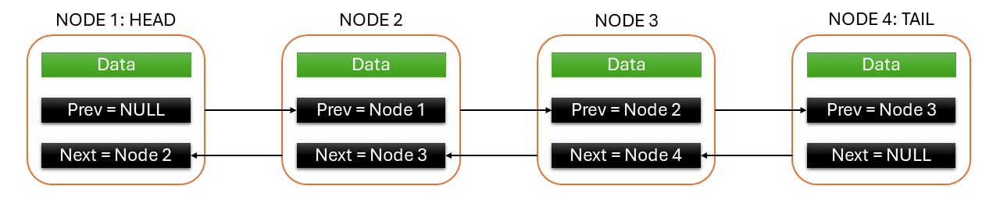

<h1>
  Doubly Linked Lists in Java
  Doubly Linked Lists
</h1>

**Learning objective:** By the end of this lesson, you'll be able to describe a doubly linked list data structure.

## Doubly linked lists

Doubly linked list is a bi-directional linked list in which a node contains a reference to the previous as well as the next node in the sequence. Therefore, in a doubly-linked list, a node consists of three variables:
- One **data** variable to store a value.
- Two **reference** variables: 
  - One containing a reference to the subsequent node in the list.
  - One containing a reference to the preceding node in the list.

### Characteristics of a doubly linked list data structure
- A doubly linked list contains a reference to its:
  - The first node or the **head node** which has a `null` value in its reference variable to the preceding node.
  - The last node or the **tail node** which has a `null` value in its reference variable to the subsequent node.
- A doubly linked list can be traversed in both directions

## Common doubly linked list operations
- **Insert** : Adds a node at the beginning, end, or any position.
- **Delete** : Removes a node at the beginning, end, or any position.
- **Traverse Forward** : Accesses nodes sequentially from head node to tail node.
- **Traverse Backward** : Accesses nodes sequentially from tail node to head node.
- **Search**: Finds a node in the list.

## Time complexity of doubly linked list
- **Inserting or deleting a node at the beginning**: Similar to singly linked lists, the time complexity of inserting or deleting a node at the beginning is not proportional to the size of the list. The time complexity would be a constant O(1).
- **Inserting or deleting a node at the end**: Unlike singly linked lists, the time complexity of inserting or deleting a node at the end is not proportional to the size of the list. Hence, the time complexity would be a constant O(1) which is better than that of singly linked lists' O(n)
- **Inserting or deleting a node in the middle**: Similar to singly linked lists, the time taken to traverse the list is proportional to the n number of elements, and the time complexity for the average case would be O(n).
- **Space complexity**: In all these operations, there is no need to create any additional memory space to realise them. Hence, the space complexity of these operations are constant O(1).

## Final reflections
1. Doubly Linked Lists allow efficient insertion, deletion, and bidirectional traversal.
2. Each node contains data, next, and prev pointers.
3. They are more versatile than singly linked lists but require more memory due to the additional pointer.